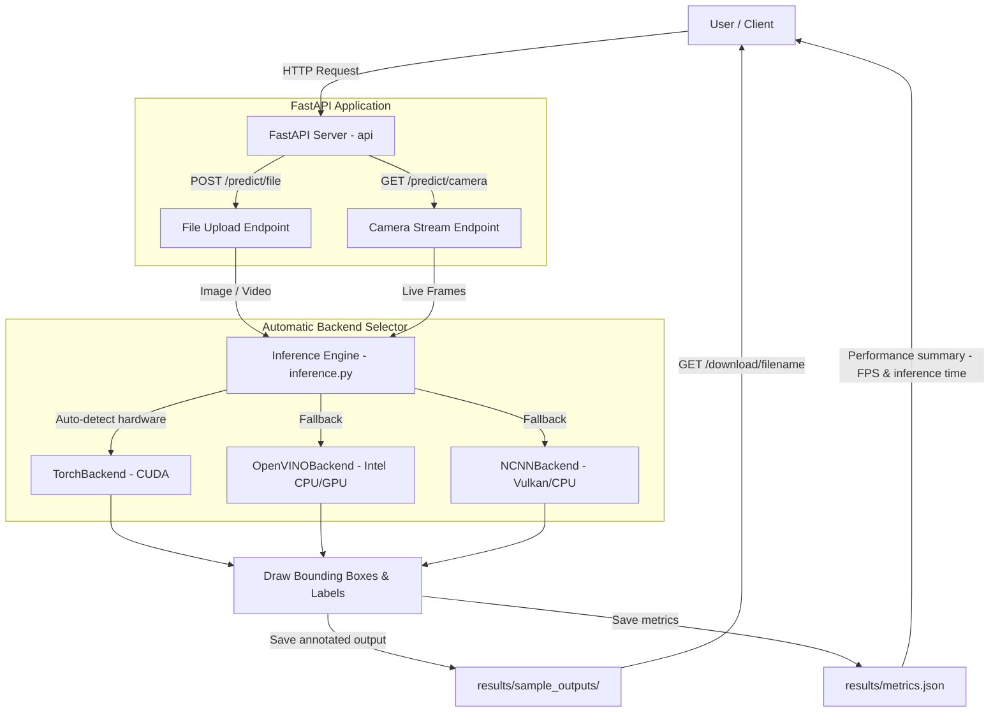
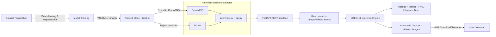
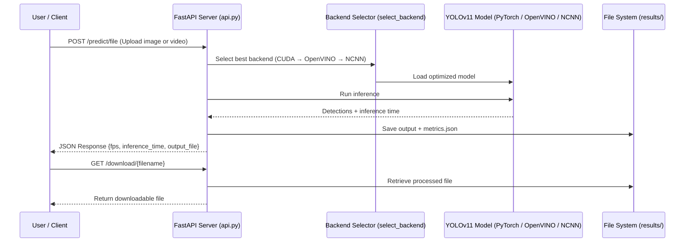

# HVAC Detection System – YOLOv11

This project implements an **AI-based system for automatic HVAC equipment detection** using YOLOv11 and optimized inference with **OpenVINO**, **ONNX**, or **NCNN**, depending on the available hardware.  
It includes both a **local interactive mode** (console) and a **REST API** for remote deployment and integration.

---

## Table of Contents

- [Project Structure](#️-project-structure)
- [Installation](#-installation)
- [Local Inference Mode](#-local-inference-mode)
- [API Server Mode](#-api-server-mode)
- [API Endpoints Overview](#-api-endpoints-overview)
- [System Flow Diagram](#-system-flow-diagram)
- [End-to-End Pipeline](#-end-to-end-pipeline)
- [Model Card](#-model-card)
- [API Architecture Overview](#-api-architecture-overview)
- [Performance Metrics](#-performance-metrics)
- [Future Improvements](#-future-improvements)
- [Author](#-author)

---

## Project Structure

```
HVAC_YOLO/
│
│
├── data/
│   ├── annotated/                 # My annotations
│   ├── processed/                 # Train/val splits
│   └── raw/                       # Only relevant images from dataset provided
│
├── models/
│   ├── experiments/               # Training runs
│   └── final/                     # Best model weights
│       ├── best.pt                # For Nvidia GPU
│       ├── best_openvino_model/   # For Intel IrisXe GPU (.xml + .bin)
│       ├── best_saved_model/      # Quantization for Google Coral (.tflite)
│       ├── best.onnx              # ONNX export that remained throught (deployable)
│       └── best_ncnn_model/       # NCNN export for other GPU/low end devices
│
├── src/
│   ├── __init__.py
│   ├── inference.py               # Local console inference
│   ├── train.py                   # For training, update libraries first
│   ├── train.ipynb                # Upload it to Colab and run!
│   └── api.py                     # FastAPI REST server
│
├── tests/
│    ├── __init__.py
│    └── test_train.py             # Unit tests (mocked YOLO)
│
│
├── docker/
│   ├── Dockerfile                 # Container definition
│   └── docker-compose.yml
│
├── configs/
│   └── config.yaml                # Configuration
│
├── DEMO/                          # Demostration videos + Reports (json)
│
├── results/
│   ├── sample_outputs/            # Example detections
│   └── metrics.json               # Performance logs
│
├── requirements.txt
└── README.md                      # Complete documentation
```

---

## Installation

### 1️. Clone the repository
```bash
git clone https://github.com/yourusername/HVAC_YOLO.git
cd HVAC_YOLO
```

### 2️. Create and activate a virtual environment
```bash
python -m venv venv
venv\Scripts\activate        # On Windows
source venv/bin/activate       # On Linux/Mac
```

### 3️. Install dependencies
```bash
pip install -r requirements.txt
```


### 4️. Run with Docker
You can run this project fully containerized:

```bash
# Build the Docker image
docker compose build
# Start the container and API server
docker compose up
```

Then open:

http://localhost:8000
 → API root

http://localhost:8000/docs
 → Interactive Swagger UI

## Model Training

To retrain the model locally or on any environment:

```bash
python src/train.py
```
The script will automatically download the dataset from Roboflow using your API key, train Yolov11 on your CPU or GPU (auto-detected), then save metrics and per-class performance reports, and finally export the model to mutiple formats (NCNN, OpenVino, EdgeTPU).

Make sure to create a .env file with your Roboflow API key: <br>
```bash
ROBOFLOW_KEY=your_api_key_here
```

You can also customize the training process using CLI arguments:
```bash
python src/train.py --epochs 150 --model yolo11m.pt --imgsz 512 --device cuda
```
After training, all results and weights are saved automatically in: <br>
runs/train/hvac_yolov11/
results/train_metrics.json
results/per_class_metrics.json

Alternatively, use the provided notebook in Google Colab:
```bash
Upload and execute src/train.ipynb
```

The trained weights will be saved automatically in:
```bash
models/final/best.pt
```
Make sure your dataset structure matches YOLO format (train/, val/, data.yaml).

## Testing

Basic unit tests are provided to validate the training and export functions without requiring GPU or dataset downloads.

Run all tests with:
```bash
pytest -v
```

## Local Inference Mode

Run the console-based version (for local testing or development):

```bash
python src/inference.py
```

You’ll be prompted:
```
Select inference mode:
1. Camera
2. Local file (image or video)
👉 Enter 1 or 2:
```

All results and metrics are automatically saved in:
```
results/sample_outputs/
results/metrics.json
```

---

## API Server Mode

Start the REST API server:
```bash
uvicorn src.api:app --host 0.0.0.0 --port 8000
```

Then open:
- Root endpoint → [http://localhost:8000](http://localhost:8000)
- Interactive Swagger docs → [http://localhost:8000/docs](http://localhost:8000/docs)

---

## API Endpoints Overview

| Endpoint | Method | Description |
|-----------|--------|-------------|
| `/` | GET | Health check and backend info |
| `/predict/file` | POST | Upload an image or video (automatically detected) |
| `/predict/camera` | GET | Capture live video from the server’s camera (default 10s) |
| `/download/{filename}` | GET | Download processed files |

---

## System Flow Diagram


```mermaid
flowchart TD
    User[User / Client] -->|HTTP Request| API[FastAPI Server - api]

    subgraph FastAPI["FastAPI Application"]
        API -->|POST /predict/file| FileHandler[File Upload Endpoint]
        API -->|GET /predict/camera| CameraHandler[Camera Stream Endpoint]
    end

    FileHandler -->|Image / Video| Inference[Inference Engine - inference.py]
    CameraHandler -->|Live Frames| Inference

    subgraph Backends["Automatic Backend Selector"]
        Inference -->|Auto-detect hardware| Torch[TorchBackend - CUDA]
        Inference -->|Fallback| OpenVINO[OpenVINOBackend - Intel CPU/GPU]
        Inference -->|Fallback| NCNN[NCNNBackend - Vulkan/CPU]
    end

    Torch --> Drawing[Draw Bounding Boxes & Labels]
    OpenVINO --> Drawing
    NCNN --> Drawing

    Drawing -->|Save annotated output| Outputs[results/sample_outputs/]
    Drawing -->|Save metrics| Metrics[results/metrics.json]

    Outputs -->|GET /download/filename| User
    Metrics -->|Performance summary - FPS & inference time| User
```

---

## End-to-End Pipeline


```mermaid
flowchart LR
    Dataset[Dataset Preparation] -->|Data cleaning & augmentation| Training[Model Training]
    Training -->|YOLOv11 variants| Model[Trained Model - best.pt]

    Model -->|Export to OpenVINO| OpenVINO[OpenVINO]
    Model -->|Export to NCNN| NCNN[NCNN]

    subgraph Backends["Automatic Backend Selector"]
        OpenVINO --> Inference
        NCNN --> Inference
    end

    Inference[inference.py + api.py] --> API[FastAPI REST Interface]
    API --> Upload[User Uploads - Image/Video/Camera]
    Upload --> YOLO[YOLOv11 Inference Engine]
    YOLO --> Results[Results + Metrics - FPS, Inference Time]
    YOLO --> Outputs[Annotated Outputs - Videos / Images]
    Outputs -->|GET /download/filename| User[User Download]
```

## Model Card

**Model Name:** HVAC_YOLOv11  
**Architecture:** YOLOv11 (Ultralytics, 2024)  
**Purpose:** Automatic detection and classification of HVAC systems (RTU, Split, Chiller, Condenser, etc.) from images and videos.  
**Dataset:** Custom HVAC dataset with 3 equipment classes (collected and labeled via Roboflow).  
**Input Size:** 640 × 640  
**Training Epochs:** 100
**Framework:** PyTorch + Ultralytics YOLOv11  
**Export Formats:**  
- PyTorch (`best.pt`)  
- OpenVINO (for Intel CPU/GPU inference)  
- NCNN (for lightweight devices)  

**Performance Metrics:**  
| Metric | Value |
|--------|--------|
| mAP@50 | **0.798** |
| Precision | **0.98** |
| Recall | **0.85** |
| F1 all@0.37 | **0.78** |
| Inference Speed (OpenVINO) | **30 FPS** on Intel Iris Xe |

**Intended Use:**  
Industrial automation and HVAC asset monitoring — to assist in identifying HVAC units in rooftop or field environments.  

**Limitations:**  
Performance may vary with unseen lighting conditions or new equipment types not present in the training dataset.

**You can download the trained weights from here as well**  
https://drive.google.com/drive/folders/1YOf2pH2CKnbWCCOHNBr500WetnxGjDAL?usp=sharing

---

## API Architecture Overview


```mermaid
sequenceDiagram
    participant U as User / Client
    participant A as FastAPI Server (api.py)
    participant B as Backend Selector (select_backend)
    participant M as YOLOv11 Model (PyTorch / OpenVINO / NCNN)
    participant F as File System (results/)

    U->>A: POST /predict/file (Upload image or video)
    A->>B: Select best backend (CUDA → OpenVINO → NCNN)
    B->>M: Load optimized model
    A->>M: Run inference
    M-->>A: Detections + inference time
    A->>F: Save output + metrics.json
    A-->>U: JSON Response {fps, inference_time, output_file}
    U->>A: GET /download/{filename}
    A->>F: Retrieve processed file
    A-->>U: Return downloadable file
```

---

## Performance Metrics

Every run stores metrics in:
```
results/metrics.json
```

Example:
```json
{
  "mode": "video",
  "file": "VID-20250916-WA0002.mp4",
  "frames": 1320,
  "avg_fps": 44.98,
  "avg_inference_time_ms": 18.8
}
```

Target performance: **≥20 FPS @ 720p**  
Achieved @ Yolov11n: **~45 FPS (OpenVINO, Intel Iris Xe)**<br>
Achieved @ Yolov11s: **~30 FPS (OpenVINO, Intel Iris Xe)**
---

## Future Improvements

- Add live dashboard (Node-RED or React) to visualize detections.  
- Implement async inference and batch processing.  
- Enable remote cloud training with GCP/Azure ML.  
- Quantize models for EdgeTPU deployment on Raspberry Pi.

---

## 👨‍💻 Author

**Camilo Carcamo**  
AI Developer & Mechatronics Engineer
📍 Lima, Peru<br>
📧 [lc.carcamo@hotmail.com]<br>
🧾 Project developed as part of HVAC AI detection assignment (2025)