# HVAC Detection System – YOLOv11

This project implements an **AI-based system for automatic HVAC equipment detection** using YOLOv11 and optimized inference with **OpenVINO**, **ONNX**, or **NCNN**, depending on the available hardware.  
It includes both a **local interactive mode** (console) and a **REST API** for remote deployment and integration.

---

## Table of Contents

- [Project Structure](#️-project-structure)
- [Installation](#-installation)
- [Local Inference Mode](#-local-inference-mode)
- [API Server Mode](#-api-server-mode)
- [API Endpoints Overview](#-api-endpoints-overview)
- [System Flow Diagram](#-system-flow-diagram)
- [End-to-End Pipeline](#-end-to-end-pipeline)
- [API Architecture Overview](#-api-architecture-overview)
- [Performance Metrics](#-performance-metrics)
- [Future Improvements](#-future-improvements)
- [Author](#-author)

---

## Project Structure

```
HVAC_YOLO/
│
│
├── data/
│   ├── annotated/                 # My annotations
│   ├── processed/                 # Train/val splits
│   └── raw/                       # Only relevant images from dataset provided
│
├── models/
│   ├── experiments/               # Training runs
│   └── final/                     # Best model weights
│       ├── best.pt                # For Nvidia GPU
│       ├── best_openvino_model/   # For Intel IrisXe GPU (.xml + .bin)
│       ├── best_saved_model/      # Quantization for Google Coral (.tflite)
│       ├── best.onnx              # ONNX export that remained throught (deployable)
│       └── best_ncnn_model/       # NCNN export for other GPU/low end devices
│
├── src/
│   ├── __init__.py
│   ├── inference.py               # Local console inference
│   ├── train.py                   # For training, update libraries first
│   ├── train.ipynb                # Upload it to Colab and run!
│   └── api.py                     # FastAPI REST server
│
├── docker/
│   ├── Dockerfile                 # Container definition
│   └── docker-compose.yml
│
├── configs/
│   └── config.yaml                # Configuration
│
├── test/                          # Basic tests
│
├── results/
│   ├── sample_outputs/            # Example detections
│   └── metrics.json               # Performance logs
│
├── requirements.txt
└── README.md                      # Complete documentation
```

---

## Installation

### 1️. Clone the repository
```bash
git clone https://github.com/yourusername/HVAC_YOLO.git
cd HVAC_YOLO
```

### 2️. Create and activate a virtual environment
```bash
python -m venv venv
venv\Scripts\activate        # On Windows
source venv/bin/activate       # On Linux/Mac
```

### 3️. Install dependencies
```bash
pip install -r requirements.txt
```

---

## Local Inference Mode

Run the console-based version (for local testing or development):

```bash
python src/inference.py
```

You’ll be prompted:
```
Select inference mode:
1. Camera
2. Local file (image or video)
👉 Enter 1 or 2:
```

All results and metrics are automatically saved in:
```
results/sample_outputs/
results/metrics.json
```

---

## API Server Mode

Start the REST API server:
```bash
uvicorn src.api:app --host 0.0.0.0 --port 8000
```

Then open:
- Root endpoint → [http://localhost:8000](http://localhost:8000)
- Interactive Swagger docs → [http://localhost:8000/docs](http://localhost:8000/docs)

---

## API Endpoints Overview

| Endpoint | Method | Description |
|-----------|--------|-------------|
| `/` | GET | Health check and backend info |
| `/predict/file` | POST | Upload an image or video (automatically detected) |
| `/predict/camera` | GET | Capture live video from the server’s camera (default 10s) |
| `/download/{filename}` | GET | Download processed files |

---

## System Flow Diagram

```mermaid
flowchart TD
    User[User / Client] -->|HTTP Request| API[FastAPI Server - api]

    subgraph FastAPI["FastAPI Application"]
        API -->|POST /predict/file| FileHandler[File Upload Endpoint]
        API -->|GET /predict/camera| CameraHandler[Camera Stream Endpoint]
    end

    FileHandler -->|Image / Video| Inference[Inference Engine - inference.py]
    CameraHandler -->|Live Frames| Inference

    subgraph Backends["Automatic Backend Selector"]
        Inference -->|Auto-detect hardware| Torch[TorchBackend - CUDA]
        Inference -->|Fallback| OpenVINO[OpenVINOBackend - Intel CPU/GPU]
        Inference -->|Fallback| NCNN[NCNNBackend - Vulkan/CPU]
    end

    Torch --> Drawing[Draw Bounding Boxes & Labels]
    OpenVINO --> Drawing
    NCNN --> Drawing

    Drawing -->|Save annotated output| Outputs[results/sample_outputs/]
    Drawing -->|Save metrics| Metrics[results/metrics.json]

    Outputs -->|GET /download/filename| User
    Metrics -->|Performance summary (FPS, inference time)| User
```

---

## End-to-End Pipeline


---

## API Architecture Overview

```mermaid
sequenceDiagram
    participant U as User / Client
    participant A as FastAPI Server (api.py)
    participant B as Backend Selector (select_backend)
    participant M as YOLOv11 Model (PyTorch / OpenVINO / NCNN)
    participant F as File System (results/)

    U->>A: POST /predict/file (Upload image or video)
    A->>B: Select best backend (CUDA → OpenVINO → NCNN)
    B->>M: Load optimized model
    A->>M: Run inference
    M-->>A: Detections + inference time
    A->>F: Save output + metrics.json
    A-->>U: JSON Response {fps, inference_time, output_file}
    U->>A: GET /download/{filename}
    A->>F: Retrieve processed file
    A-->>U: Return downloadable file
```



---

## Performance Metrics

Every run stores metrics in:
```
results/metrics.json
```

Example:
```json
{
  "mode": "video",
  "file": "VID-20250916-WA0002.mp4",
  "frames": 1320,
  "avg_fps": 44.98,
  "avg_inference_time_ms": 18.8
}
```

Target performance: **≥20 FPS @ 720p**  
Achieved @ Yolov11n: **~45 FPS (OpenVINO, Intel Iris Xe)**
Achieved @ Yolov11s: **~30 FPS (OpenVINO, Intel Iris Xe)**
---

## Future Improvements

- Add live dashboard (Node-RED or React) to visualize detections.  
- Implement async inference and batch processing.  
- Enable remote cloud training with GCP/Azure ML.  
- Quantize models for EdgeTPU deployment on Raspberry Pi.

---

## 👨‍💻 Author

**Camilo Carcamo**  
AI Developer & Mechatronics Engineer
📍 Lima, Peru<br>
📧 [lc.carcamo@hotmail.com]<br>
🧾 Project developed as part of HVAC AI detection assignment (2025)